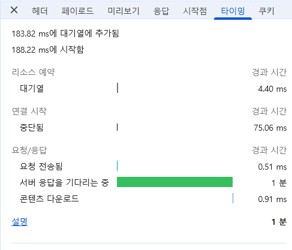
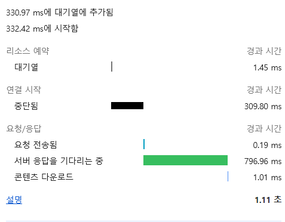

# ES 조회 느린 거 Transform 롤업으로 개선한 거

회사에서 시계열 데이터를 시간 단위로 집계해서 차트로 보여주는 화면이 있는데, 조회가 너무 느려서 고친 걸 정리해둔다.

## 뭐가 문제였냐면

네트워크 통신 통계를 분 단위로 ES에 쌓고 있었고, 화면에서는 그걸 시간 단위로 묶어서 차트로 보여주고 있었다.

필터에 출발지 IP랑 포트를 넣고 조회하는데,

- 단일 IP + 단일 포트로 조회하면 빠르다.
- 근데 서브넷(대역)이랑 포트 여러 개를 같이 조회하니까 수 초에서 수십 초까지 걸리더라.

처음엔 왜 이렇게 차이가 나는지 감이 안 왔다.

## 원인은 문서 수였다

파고 보니까 결국 ES가 읽어야 하는 문서 건수 문제였다.

문서를 구분하는 hashkey에 `src_port`(출발지 포트)가 조합으로 들어가 있었는데, 클라이언트는 같은 서비스로 통신해도 연결할 때마다 src_port가 새로 열린다. 그래서 같은 서비스 통신이어도 연결한 횟수만큼 문서가 N개로 쪼개져서 저장되고 있었던 거다.

```
같은 서비스 통신 (A -> B, dst_port 443)
  연결1 -> src_port 51001 -> 문서 1개
  연결2 -> src_port 51002 -> 문서 1개
  연결3 -> src_port 51003 -> 문서 1개
  ...
서비스는 하난데 문서만 계속 쌓임
```

여기에 원본이 분 단위로 쌓이니까, 서브넷처럼 범위가 넓어지면 읽어야 할 문서가 확 늘어난다. 화면은 시간 단위로 합계를 내야 하는데 그러려면 이 많은 문서를 다 훑어야 하니까 오래 걸린 거였다. 단일 IP/포트가 빨랐던 건 읽을 문서가 적어서였고.

## 1차 - 쿼리 손보기

일단 쿼리부터 고쳤다. 집계 방식을 바꾸고, 조회 구간에 해당하는 인덱스만 타도록 해서 쓸데없는 인덱스 스캔을 줄였다.

효과는 있었는데, 원본 문서 수 자체가 많다 보니 쿼리만으로는 한계가 있었다.

## 2차 - ES Transform으로 롤업

그래서 ES Transform을 써서 분 단위 원본을 시간 단위로 미리 집계한 롤업 인덱스를 따로 만들었다. 원본은 그대로 두고 집계 인덱스를 추가하는 방식이라 부담이 적었다.

분 단위를 시간 단위로 압축하니까 문서 수랑 용량이 확 줄었고, 조회할 때 원본 대신 이 롤업 인덱스를 읽으면 이미 시간별로 집계돼 있어서 스캔할 문서가 훨씬 적다. 그래서 엄청 빨라졌다.

Transform은 대충 이런 식으로 생겼다.

```json
PUT _transform/metrics_hourly
{
  "source": { "index": "metrics-*" },
  "dest":   { "index": "metrics-hourly" },
  "pivot": {
    "group_by": {
      "timestamp": {
        "date_histogram": { "field": "@timestamp", "calendar_interval": "1h" }
      },
      "src_ip":   { "terms": { "field": "src_ip" } },
      "dst_ip":   { "terms": { "field": "dst_ip" } },
      "dst_port": { "terms": { "field": "dst_port" } }
    },
    "aggregations": {
      "bytes_sum":     { "sum": { "field": "bytes" } },
      "session_count": { "value_count": { "field": "src_port" } }
    }
  }
}
```

`group_by`에 시간(`date_histogram`)이랑 의미 있는 키(출발지/목적지 IP, 목적지 포트)만 넣고, 문제였던 `src_port`는 빼버렸다. 대신 세션 수가 필요하면 `value_count`로 개수만 세서 집계값으로 남기면 된다.

새로 들어오는 데이터도 계속 롤업하려면 continuous transform(`sync.time`)으로 걸어두면 주기적으로 알아서 집계해준다.

## 얼마나 빨라졌냐

서브넷 + 다중 포트로 무겁게 조회하는 같은 조건에서 비교했다. 개발자 도구 Network 타이밍 탭으로 잰 거다.

- 개선 전: 서버 응답 대기만 1분 넘게 걸림
- 개선 후: 같은 조회가 1.11초 (서버 응답 대기 약 797ms)

| 개선 전 | 개선 후 |
|---|---|
|  |  |

## 느낀 점

- 조회 느릴 때 쿼리만 붙잡고 있었는데, 결국 읽어야 하는 문서 수가 많으면 쿼리 튜닝만으로는 답이 없다. 데이터를 어떻게 쪼개서 저장하고 있는지(뭘 문서 키로 두는지)를 봐야 했다.
- src_port처럼 값이 매번 바뀌는 필드를 문서 키 조합에 넣으면 문서가 걷잡을 수 없이 늘어난다. 집계용이면 이런 건 키에서 빼는 게 맞다.
- 시계열 대시보드는 사전 집계가 확실히 강력하다. 조회할 때마다 raw 훑지 말고 자주 쓰는 단위로 미리 말아두면 된다.
- 원본을 살려두니까 롤업에 문제 생겨도 바로 원복할 수 있어서 마음이 편했다.
- Transform은 basic 라이선스에 기본으로 들어있어서 돈 안 든다. 대신 처음 롤업 만들 때 데이터량 따라 몇 분에서 몇십 분 걸리니까 그건 감안해야 한다.
- 만들어둔 롤업 인덱스는 이 화면 말고 다른 시간대 차트나 통계에도 갖다 쓸 수 있어서 두고두고 이득이다.
