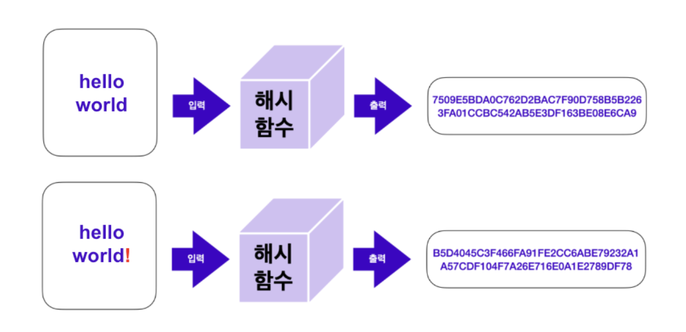

# 해시 함수

> 해시 함수란 임의의 길이를 가진 데이터를 입력받아 고정된 길이의 값을 출력하는 함수이다.

## 특징

### 1. 단방향성

해시 함수는 단방향성을 가지고 있어서 입력 데이터에서 해시값으로 변환은 쉽지만, **해시값에서 원래 데이터로 역변환은 거의 불가능**하다. 이는 해시 함수가 데이터의 무결성을 보장하고 보안 용도로 활용되는 데에 중요한 특징이다.

이러한 단방향성을 평가하는 척도 중 하나가 **역상 저항성(preimage resistance)** 이다. 역상 저항성이 우수하다는 건 어떤 해시 함수가 특정한 값을 출력하는 입력값을 찾기 어려움을 의미한다.

### 2. 해시 충돌

해시 함수는 서로 다른 입력에 대해 동일한 해시값을 출력할 수 있다. 이를 **해시 충돌**이라고 부른다. 좋은 해시 함수는 충돌을 최소화해야 하며, 보안 측면에서 안전한 해시 함수는 매우 낮은 충돌 확률을 보장해야 한다.

이를 평가하는 척도를 **충돌 저항성(collision resistance)** 으로 표현한다. 충돌 저항성이 우수하다는 건 어떤 해시 함수가 충돌하는 서로 다른 두 입력값을 찾기 어려움을 의미한다.

### 3. 고정된 결과값의 길이

해시 함수는 항상 일정한 길이의 결과값을 출력한다. 입력 데이터의 크기가 다르더라도 항상 동일한 길이의 해시값을 반환하기 때문에 블록체인과 같은 분산 시스템에서 데이터의 일관성과 효율적인 처리를 보장하는 데에 유용하다.

예를 들어 대용량 데이터에 변조가 일어났는지 확인할 때, 일일이 모든 데이터를 대조하는 것보다 데이터의 해시값을 비교하면 변조 여부를 쉽게 확인할 수 있다. 이러한 검사 방법을 **데이터 무결성 검사**라고 한다.
