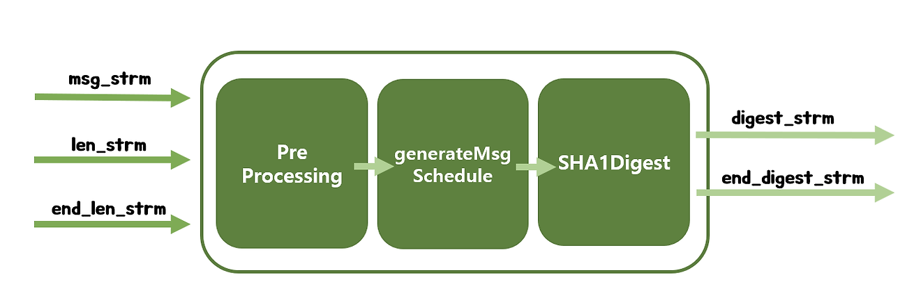
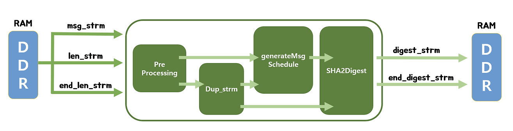

# SHA

안전한 [해시 함수](hash-function.md)의 예로 SHA가 있다.

SHA는 **출력 길이에 따라 SHA-256, SHA-384, SHA-512** 등으로 나뉜다.

## SHA-1 (Secure Hash Algorithm - 1)

> SHA-0을 변형한 SHA 함수들 중 하나이며, 1995년 발표되었고 SHA 함수들 중 가장 많이 쓰이던 함수이다.

SHA-1은 1995년 미국 국가안보국이 설계한 암호학적 해시 함수이다. 264비트의 메시지로부터 160비트의 해시값을 만들어 내고, 입력 메시지는 512비트 단위로 패딩을 적용하는 방식을 사용한다.

- 패딩: 100개의 공간에 문자 1개가 들어오면 나머지 99개의 공간을 숫자 0 등으로 메우는 작업

### 문제점

- **충돌쌍 문제**: 두 데이터에 대한 해시를 계산하였더니 같은 결과값이 도출되는 것.
- 충돌쌍 문제를 악용한다면 시스템 내부의 파일을 제멋대로 교체해버리고서는 마치 기존에 존재하던 파일인 것처럼 둔갑시킬 수 있어, 보안상 상당히 치명적인 문제이다.

이러한 문제 때문에 **SHA-1 사용이 지양되고 SHA-2가 권장**되고 있다.

## SHA-2 (Secure Hash Algorithm - 2)

> 미국 국가안전보장국(NSA)이 2001년 설계한 암호화 해시 함수들의 집합이다.

SHA-2에는 여러 종류의 알고리즘이 있다. SHA-224, SHA-256, SHA-384, SHA-512 등을 통칭해서 SHA-2라고 부른다. 수학적으로는 충돌 가능성이 존재하지만 공학적으로는 그 가능성이 없다고 봐도 무방하다.

**특징**으로는 해시값에 대해 계산된 해시를 비교함으로써 사람이 데이터의 무결성을 파악할 수 있다는 점이다. 다운로드한 파일의 해시를 계산한 다음 이전에 게시된 해시 결과와 비교하면 다운로드한 파일이 수정 또는 조작되었는지 알 수 있다.

### 종류

[SHA-256](sha-256.md)

- 현재 가장 많이 채택되어 사용되고 있는 암호 방식
- SHA-512보다 훨씬 빠르게 해시 생성
- 안전성 문제에서도 큰 단점이 발견되지 않음
- 256비트로 축약된 메시지
- 속도가 빠르다.

[SHA-512](sha-512.md)

- 512비트(64바이트) 해시값을 생성
- 길이 확장 공격에 대해 취약
- 결과값이 512비트로 나와서 용량을 많이 차지한다.
