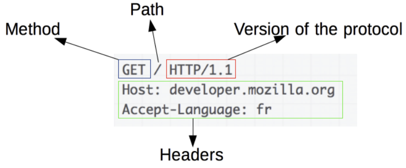
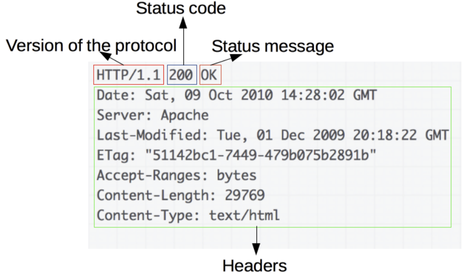
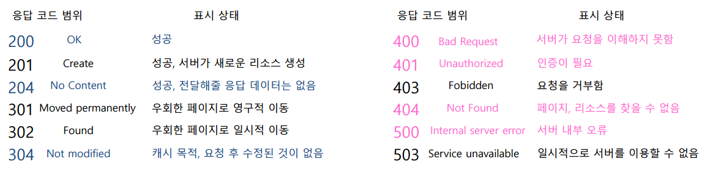

# HTTP

**HTTP(HyperText Transfer Protocol)** 는 주로 HTML과 같은 HyperText 문서를 주고받기 위해 만들어졌고, 최근에는 HTML뿐 아니라 모든 웹 관련 API 통신에 이용되는 **통신 프로토콜**이다.

HTTP는 **비연결성(Connectionless)** 과 **무상태성(Stateless)** 의 특징을 가진다.

- **비연결성(Connectionless)**: 처음 연결을 맺은 후 요청(Request)과 한 번의 응답(Response) 이후 연결이 종료된다. 매 요청마다 다시 연결을 맺는다. 매번 연결을 맺어 느려지는 것을 보완하기 위해 keep-alive와 같은 속성을 활용할 수 있다.
- **무상태성(Stateless)**: 프로토콜에서 Client의 상태를 기억하지 않는다. Client의 상태를 보관하기 위해 쿠키, 세션, JWT 토큰 등을 이용한다.

비연결성과 무상태성이라는 특징은 통신을 위한 소프트웨어 구조를 단순하게 만들어 주며, 몇몇 성능 이슈에도 불구하고 가장 인기 있는 통신 프로토콜이 되게 해 주었다.

또한 특징으로는:

- 일반적으로 TCP/IP 통신 프로토콜 위에서 동작하며, 예외적으로 UDP 프로토콜도 사용한다.
- TCP/IP 프로토콜을 이용하는 경우 **80번 포트**를 사용한다.
- 단방향성이다. 사용자의 하나의 요청에 하나의 응답을 하는 방식이기 때문에 서버가 먼저 응답하지 않는다.

## HTTP 프로토콜의 문제점

- HTTP는 **평문 통신**이기 때문에 도청이 가능하다.
- 통신 상대를 확인하지 않기 때문에 위장이 가능하다.
- 따로 암호화 과정을 거치지 않기 때문에 중간에 패킷을 가로채거나 수정할 수 있어 보안에 취약하다.
- 이를 보완하기 위해 등장한 것이 [HTTPS](https.md)이다.

## HTTP 요청 메서드

웹에서는 요청하는 데이터에 특정 동작을 하기 위해 요청 메서드를 이용한다.

- **GET**: 존재하는 자원에 대한 요청 (Read)
- **POST**: 새로운 자원에 대한 요청 (Create)
- **PUT**: 존재하는 자원에 대한 변경 (Update)
- **DELETE**: 존재하는 자원에 대한 삭제 (Delete)
- **HEAD**: 서버 헤드 정보를 획득. GET과 비슷하지만 Response Body를 반환하지 않음
- **OPTIONS**: 서버 옵션들을 확인하기 위한 요청. CORS에서 사용

## HTTP 메시지

클라이언트가 원하는 데이터에 대한 주문서를 적어 서버에 보내듯이, 서버도 응답 정보를 담아 클라이언트에 보낸다. 이런 정보가 담긴 메시지를 HTTP 메시지라고 부른다. HTTP 메시지에는 클라이언트 요청 메시지와 응답 메시지가 있다.

### 요청 (Request)

- 1번 줄: HTTP 요청 메서드를 맨 앞에 적고, 그 뒤에 Path, 그 뒤에 프로토콜 종류와 버전을 적는다.
- 2번 줄: 리소스를 요청하는 경로, 즉 요청하고자 하는 서버의 도메인을 적는다. 위 예시에서 포트번호가 생략된 것은 80번이 기본 포트이기 때문이다.
- 2번 줄 이후는 HTTP Request Headers 부분이다.

### 응답 (Response)

- 1번 줄: 프로토콜의 종류와 버전, HTTP 상태 코드, HTTP 상태 메시지를 적는다.
- 2번 줄 이후는 HTTP Response Headers 부분이다.

## HTTP 상태 코드

### 200번대: 성공

- **200**: GET 요청에 대한 성공
- **201**: 정상적으로 생성되었음을 알림 (회원가입 등에서 사용)
- **204**: No Content. 성공했으나 응답 본문에 데이터가 없음
- **205**: Reset Content. 성공했으나 클라이언트의 화면을 새로 고침하도록 권고
- **206**: Partial Content. 성공했으나 일부 범위의 데이터만 반환

### 300번대: 리다이렉션

대부분 클라이언트가 이전 주소로 데이터를 요청하여 서버에서 새 URL로 리다이렉트를 유도하는 경우이다.

- **301**: Moved Permanently. 요청한 자원이 새 URL에 존재
- **303**: See Other. 요청한 자원이 임시 주소에 존재
- **304**: Not Modified. 요청한 자원이 변경되지 않았으므로 클라이언트에서 캐싱된 자원을 사용하도록 권고. ETag와 같은 정보를 활용하여 변경 여부 확인

### 400번대: 클라이언트 에러

대부분 클라이언트의 요청이 잘못된 경우이다. 유효하지 않은 자원을 요청했거나 요청/권한이 잘못된 경우 발생한다.

- **400**: Bad Request. 잘못된 요청
- **401**: Unauthorized. 권한이 없음. Authorization 헤더가 잘못된 경우
- **403**: Forbidden. 서버에서 해당 자원에 대한 접근 금지
- **404**: Not Found. 요청한 자원이 서버에 존재하지 않음
- **405**: Method Not Allowed. 허용되지 않은 요청 메서드
- **409**: Conflict. 최신 자원이 아닌데 업데이트하는 경우

### 500번대: 서버 에러

- **501**: Not Implemented. 서버가 요청한 동작을 수행할 수 없는 경우
- **503**: Service Unavailable. 서버가 과부하 또는 유지 보수로 내려간 경우
