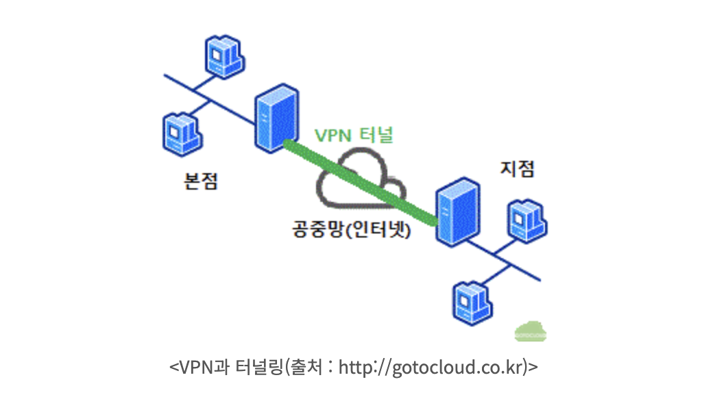

# VPN

VPN은 **Virtual Private Network**의 약자로, **가상 사설망**이라고 부른다.

**네트워크 망을 암호화해서 다른 지역에서도 인터넷으로 [사설망](private-network.md)을 안전하게 접근할 수 있는 기술**이다.

VPN은 확장성이 좋으면서 보안을 보장하기 때문에 기업에서 재택근무 또는 지사에 근무하는 임직원들을 위해 사용한다.

## 작동 원리

일반적으로 기기가 인터넷에 접속하면 기기에서 인터넷 네트워크로 요청 데이터를 전송한다. 이 요청을 보고 인터넷 네트워크는 사용자 기기의 IP 주소 등 다양한 데이터를 수집할 수 있다.

반면 VPN으로 인터넷에 연결하면 암호화 터널을 통해 데이터를 전송할 수 있다. 또한 VPN으로 접속하면 사용자 기기의 IP 주소가 노출되지 않는다. 인터넷 네트워크에서는 VPN 서버의 IP 주소로 접속한 것만 보이기 때문이다. IP 주소를 숨겨 사용자의 신원을 해커 등 악의적인 공격으로부터 보호하고, 암호화 터널로 통신하여 데이터를 보호한다.

## 유형

크게 두 가지 유형으로 나눌 수 있다.

- **원격 액세스 VPN (Remote Access)**: 주로 재택근무 또는 협력 업체에서 사내 사설망 접근이 필요할 때 사용한다. SSL/TLS 또는 IPsec 프로토콜을 사용해 데이터를 암호화한다. 여러 기기에 쉽게 설치하고 사용할 수 있다는 장점이 있다. 개인이 사용하는 VPN도 여기에 해당된다.
- **Site-to-Site VPN**: 물리적으로 떨어져 있는 본사와 지사를 같은 통합 네트워크로 연결하는 것이다. 원격 액세스 VPN과 달리 고정된 위치에서 사설망 접속이 필요할 때 사용한다. IPsec이나 GRE 터널링을 주로 사용해 안전한 네트워크 환경을 구축한다.

## 장점과 단점

### 장점

- 물리적으로 멀리 있는 기기에서도 VPN을 사용해 사설망에 접속할 수 있다.
- 인증 및 암호화 절차를 이용해 안전하게 외부에서 내부 사설망을 이용할 수 있다.
- 사설망을 사용하는 구성원의 인터넷 사용을 통제할 수 있다. 예를 들어 안전하지 않은 사이트를 미리 차단해 전사적으로 보안을 강화할 수 있다.

### 단점

- 사용자 인증, 암호화 과정을 거쳐야 하기 때문에 네트워크 속도가 평소보다 느릴 수 있다.
- 주로 타사 소프트웨어로 VPN을 구축하게 되는데, VPN 업체에서 데이터를 저장할 수도 있으므로 업체의 데이터 정책을 꼼꼼히 확인할 필요가 있다.
- 기업 단위에서 VPN을 사용하려면 구축 비용뿐만 아니라 꾸준한 운영 비용이 든다.

## 터널링

VPN은 공인 인터넷을 사이에 둔 사설망과 사설망이 공인 IP로의 NAT와 같은 제약 없이 사설 IP를 이용해 통신(Routing)할 수 있도록 지원하며 데이터 암호화를 제공한다. 이를 실현하기 위해 VPN은 공인 인터넷에서 IP 패킷을 캡슐화함과 동시에 데이터의 암호화/인증 방식을 협상한다.

이 협상 과정을 거친 후에는 캡슐화된 패킷이 오고 가기 때문에, 아무리 공인 인터넷상이라 하더라도 외부인이 쉽게 패킷을 탈취할 수 없게 된다. 이 기술을 **터널링(Tunneling)** 이라 부르며 보통 'VPN 터널이 뚫렸다'라고 표현한다. 여기서 사용된 프로토콜을 **터널링 프로토콜(Tunneling Protocol)** 이라 부른다. 패킷이 암호화되어 인터넷상에서 이동하는 특징 덕분에 외부에서 보기엔 공인 인터넷상에 가상의 터널이 생성되어 데이터를 주고받는 것처럼 보여 붙여진 이름이다.

출처: https://aws-hyoh.tistory.com/161
