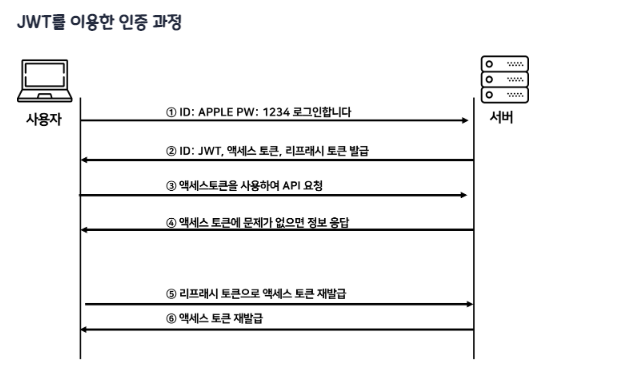

# JWT

JWT(JSON Web Token)는 인증에 필요한 정보를 토큰에 담아 암호화(서명)하여 사용하는 토큰 기반 인증 방식이다.

## 인증 과정

1. 클라이언트 사용자가 아이디, 패스워드를 통해 웹 서비스에 인증한다.
2. 서버에서 **서명된(Signed) JWT**를 생성하여 클라이언트에 응답으로 돌려준다.
3. 클라이언트가 서버에 데이터를 추가로 요청할 때 JWT를 HTTP Header에 첨부한다.
4. 서버에서 클라이언트로부터 온 JWT를 검증한다.

## 장단점

| | 장점 | 단점 |
|---|---|---|
| **Cookie & Session** | Cookie만 사용하는 방식보다 보안 향상, 서버 쪽에서 Session 통제 가능, 네트워크 부하 낮음 | 세션 저장소 사용으로 인한 서버 부하 |
| **JWT** | 인증을 위한 별도의 저장소가 필요 없음, 별도의 I/O 작업 없는 빠른 인증 처리, 확장성이 우수함 | 토큰의 길이가 늘어날수록 네트워크 부하, 특정 토큰을 강제로 만료시키기 어려움 |

## Access Token & Refresh Token

JWT도 제3자에게 토큰 탈취의 위험성이 있기 때문에, 그대로 사용하지 않고 **Access Token, Refresh Token**으로 이중으로 나누어 인증하는 방식을 현업에서 취한다.

Access Token과 Refresh Token은 둘 다 똑같은 JWT이다. 다만 토큰이 어디에 저장되고 관리되느냐에 따른 사용 차이일 뿐이다.

- **Access Token**: 클라이언트가 갖고 있는, 실제로 유저의 정보가 담긴 토큰. 클라이언트에서 요청이 오면 서버에서 해당 토큰에 있는 정보를 활용하여 사용자 정보에 맞게 응답을 진행한다.
- **Refresh Token**: 새로운 Access Token을 발급해 주기 위해 사용하는 토큰. 짧은 수명을 가지는 Access Token에게 새로운 토큰을 발급해 주기 위해 사용한다. 해당 토큰은 보통 데이터베이스에 유저 정보와 같이 기록한다.

정리하자면 Access Token은 접근에 관여하는 토큰, Refresh Token은 재발급에 관여하는 토큰의 역할로 사용되는 JWT라고 말할 수 있다.

## 사용 예시

Refresh Token의 유효기간은 2주, Access Token의 유효기간은 1시간이라 가정하자.

- 사용자가 API 요청을 하다가 1시간이 지나면 가지고 있는 Access Token은 만료된다.
- 그러면 Refresh Token의 유효기간 전까지는 Access Token을 새롭게 발급받을 수 있다.
- 즉, Refresh Token은 접근에 대한 권한을 주는 것이 아니라 Access Token 재발급에만 관여한다.
- 만일 Refresh Token의 유효기간(2주)이 만료됐다면 사용자는 새로 로그인해야 한다.
- Refresh Token도 탈취될 가능성이 있기 때문에 적절한 유효기간 설정이 필요하다. (보통 2주로 많이 잡는 편이다.)
