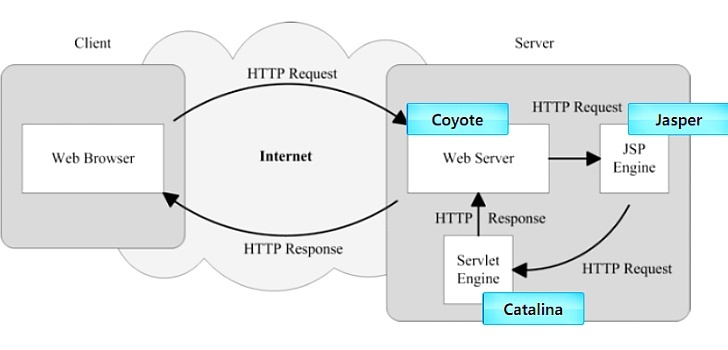
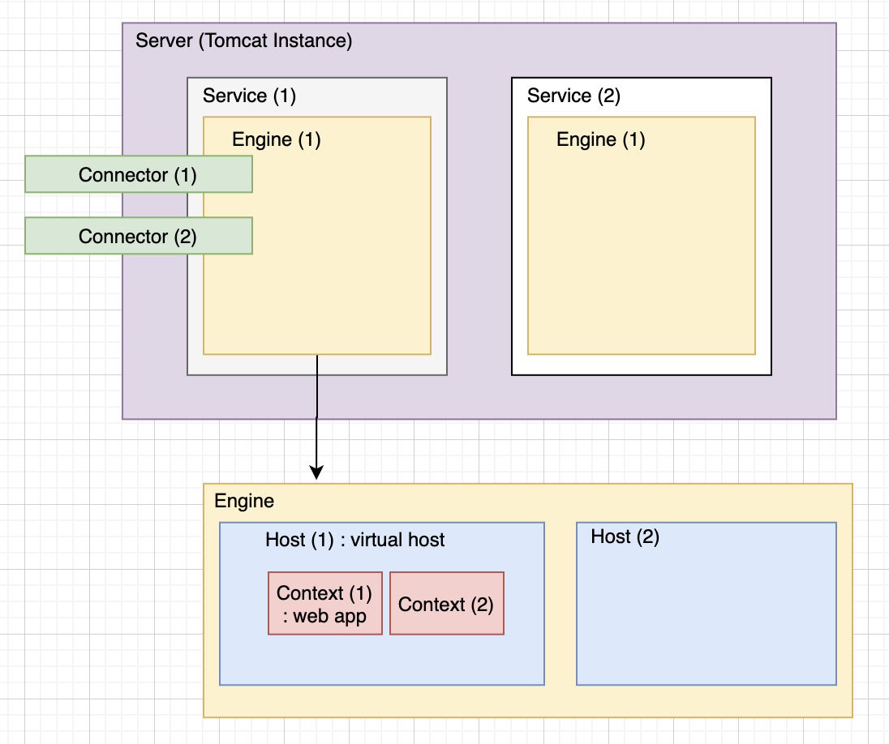
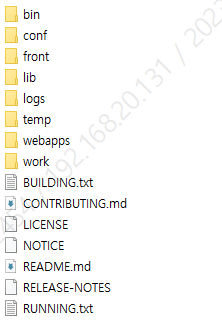

# Tomcat

## Tomcat이란

- 아파치 소프트웨어 재단의 웹 애플리케이션 서버(Web Application Server, **WAS**)
- 자바 서블릿을 실행시키고 JSP 코드가 포함된 동적 웹 페이지를 구동시켜 주는 프로그램
- 내장되어 있는 웹 서버를 이용해 독립적으로 사용될 수 있으나, 아파치(httpd)·Nginx 등의 웹 서버와 함께 사용할 수도 있다.

## Tomcat의 구조

- **Coyote** (HTTP Component): Tomcat에 TCP를 통한 프로토콜 지원
- **Catalina** (Servlet Container): 자바 서블릿을 호스팅하는 환경
- **Jasper** (JSP Engine): 실제 JSP 페이지의 요청을 처리하는 Servlet

## Tomcat의 동작

- HTTP 요청을 Coyote에서 받아서 Catalina로 전달
- Catalina에서 전달받은 HTTP 요청을 처리할 웹 애플리케이션을 찾고, `WEB-INF/web.xml` 파일 내용을 참조하여 요청을 전달
- 요청된 Servlet을 통해 생성된 JSP 파일들이 호출될 때 Jasper가 Validation Check / Compile 등을 수행

**처리 순서**

- HTTP request → Catalina → Context → Servlet → Response

> Tomcat은 JVM 위에서 동작한다.
>
> - 하나의 **JVM**에서 하나의 Tomcat Instance가 하나의 Process로 동작한다.
> - **하나의 Server**에는 **여러 개의 Service**가 존재 가능하며, 각각의 **Service는 1개의 Engine**과 **여러 개의 Connector**로 구성된다.
> - Engine은 Catalina Servlet Engine이라고도 불리며, 정의된 Connector로 들어온 요청을 하위에 있는 해당 Host에게 전달하는 역할을 수행한다.
> - **하나의 Engine**에는 **여러 개의 Host**가 존재 가능하며, Host는 가상 호스트 이름을 나타내고 호스트 이름이 곧 URL에 매핑된다.
> - **Host에는 여러 개의 Context**가 존재 가능하며, Context는 하나의 Web Application을 나타내고 주로 `*.war` 파일 형태로 배포된다.
> - Tomcat Server가 요청을 받으면 Catalina(Tomcat Engine)가 요청에 맞는 Context(Context Path)를 찾고, Context는 자신이 설정된 애플리케이션의 deployment descriptor file(web.xml)을 기반으로 전달받은 요청을 서블릿에 전달하여 처리한다.

## Tomcat 파일 구조

- **bin**: 톰캣 실행에 필요한 실행·종료 스크립트 파일이 위치
- **conf**: [Server.xml](server-xml.md) 및 서버 전체 설정과 관련된 톰캣 설정 파일들이 위치
- **lib**: 아파치와 같은 다른 웹 서버와 톰캣을 연결해 주는 바이너리 모듈들, 톰캣 구동에 필요한 라이브러리들이 위치
- **logs**: 톰캣 실행 로그 파일 위치
- **temp**: 톰캣이 실행되는 동안 임시 파일 위치
- **webapps**: 웹 애플리케이션 위치
- **work**: JSP 파일을 서블릿 형태로 변환한 java 파일과 class 파일을 저장하는 위치

## Embedded Tomcat

- 톰캣은 기본적으로 Java로 개발되어 있다.
- 일반적인 톰캣 대신 임베디드 톰캣을 사용하면 웹 애플리케이션에 내장시켜 애플리케이션과 동일한 JVM에서 실행할 수 있다.
- 마이크로서비스에 적합하다.
- Spring Boot에는 기본적으로 Embedded Tomcat이 포함되어 있다.

### Tomcat과 Embedded Tomcat의 차이

- 성능상 유의미한 차이는 없다.
- 임베디드 톰캣은 virtual host가 지원되지 않는다.
- 임베디드 톰캣은 WAS 설정을 웹 애플리케이션 내부에서 해야 한다.
- 외장 톰캣은 xml 파일로 WAS 설정을 할 수 있다.
- 부팅 속도는 임베디드 톰캣이 좀 더 빠르다.
